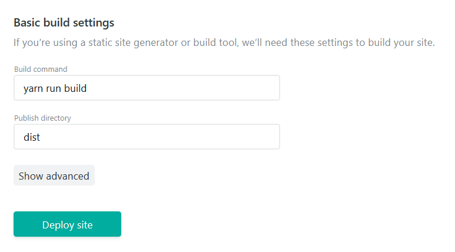

# static-react-site-generator
Um simples gerador de páginas estáticas que usa o React como mecanismo de template.

## Como usar
Clone esse repositório em seu computador e digite `yarn install` para instalar as dependências. 

**Comandos no terminal:**
- `yarn run dev`: Durante o desenvolvimento use esse comando para iniciar um servidor que automaticamente reinicia o processo de build depois de alguma alteração em qualquer componente dentro da pasta "pages".
- `yarn run build` Use para gerar todos os arquivos estáticos na pasta "dist" prontos para serem hospedados em qualquer lugar. Veja as opções na sessão [hospedagem](#hospedagem).

## Páginas
Para criar uma nova página basta criar uma pasta dentro da pasta "pages" e dentro dela criar um arquivo JavaScript com o mesmo nome.
Confuso? :p Olhe abaixo a representação visual do esquema:

```
pages
├── About
│   └─ About.js
└── Index
     └─ Index.js
```

Dentro desses arquivos você pode criar um componente normal (ou um stateless component) em React e exportá-lo como padrão no final.

```js
import React from 'react'

class Home extends React.Component {
  render() {
    return (
       <h1>Hello World!</h1>
    )
  }
}
 
export default Home
```

Infelizmente eles (ainda) não são reativos, esse projeto é mais focado em gerar páginas estáticas.

#### Bônus
Esse projeto usa o pacote [static-react](https://github.com/jxnblk/static-react) para fazer a renderização e ele permite que você crie uma função assíncrona "getInitialProps" dentro do componente que como o nome já explica serve para gerar os _props_ da página.
Ideal para fazer um fecth em uma API pública e passar a resposta para os componentes filhos.

```js
import React from 'react'
import fetch from 'isomorphic-fetch'

class Home extends React.Component {
  static async getInitialProps() {
    let posts = await fetch('https://api.example.com/data')
    
    return { posts }
  }

  render() {
    let { posts } = this.props
    
    return (
       <h1>Últimas postagens:</h1>
       <ul>
        {posts.map((item) => (
          <li>{item.title}</li>
        ))}
       </ul>
    )
  }
}
 
export default Home
```

**Pequena observação:** Essa função só é chamada durante a [renderização](#build) e não sempre que a página é carregada.

## Document
Você pode criar um html padrão que serve de _container_ para as páginas, basta criar um arquivo "Document.js" (ou o nome que você preferir) na raíz da pasta "pages"

```js
// pages/Document.js
import React from 'react';

export default (props) => (
  <html>
    <head>
      <title>Hello Word</title>
      <link rel="shortcut icon" href="/public/favicon.ico" />
    </head>
    <body>
      {props.children}
      
      <script type="text/javascript" src="http://code.jquery.com/jquery-3.3.1.slim.js"></script>
    </body>
  </html>
)
```

e importar em todas as páginas.

```js
// pages/About/About.js
import React from 'react'
import Document from '../Document.js'

class About extends React.Component {
  render() {
    return (
      <Document>
        <h1>Hello World!</h1>
      </Document>
    )
  }
}

export default About
```

## Arquivos estáticos
Coloque-os dentro da pasta "public".

## Hospedagem
~Hora do jabá 😂 ~ A melhor forma de hospedar seu site estático é usando a [Netlify](https://netlify.com/), eles tem ótimos recursos para gerenciar seu site, fazer deploys automáticos e o melhor É DE GRÁTIS!
Use essas configurações para ativar o build automático sempre que você publicar uma nova alteração no seu repositório:



## To-do
- Criar um comando que gera uma nova página bem básica.
